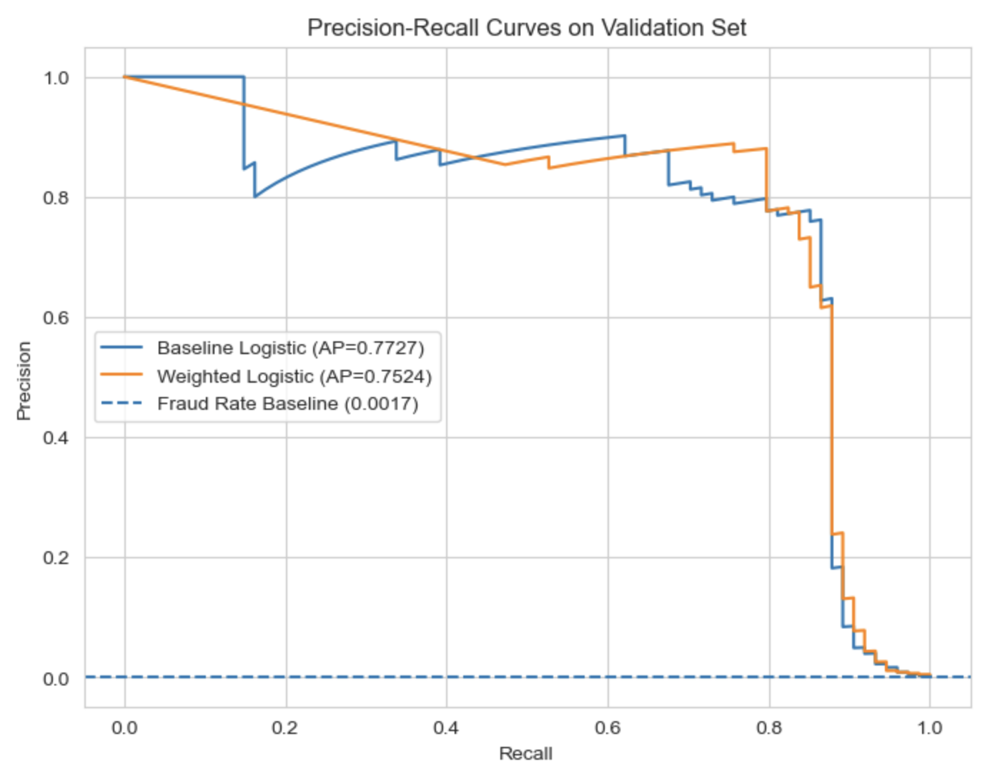
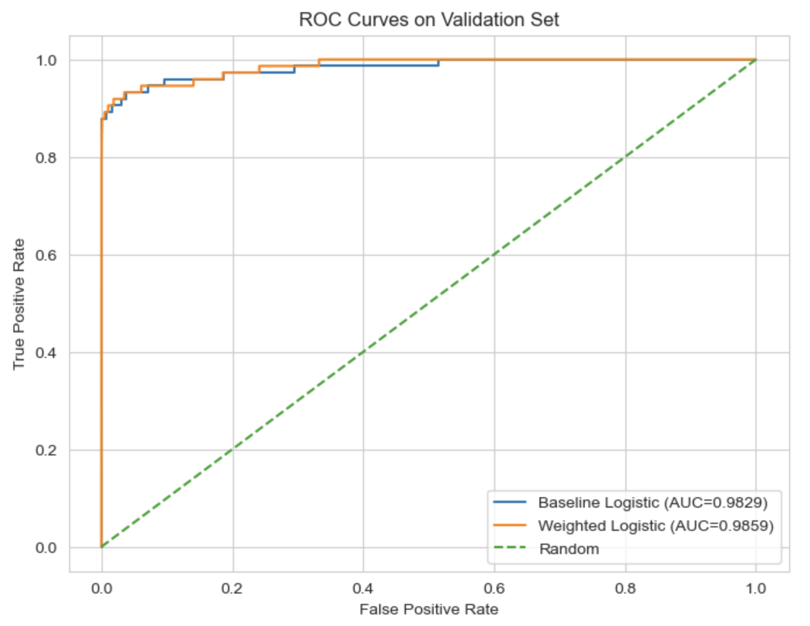
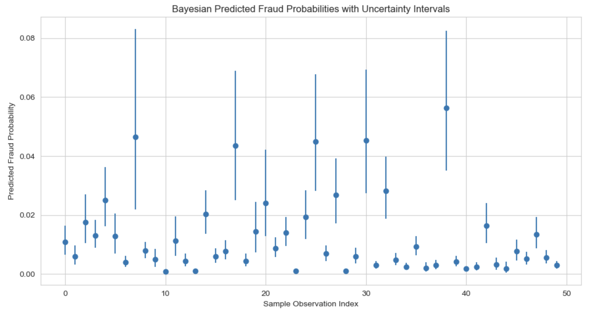
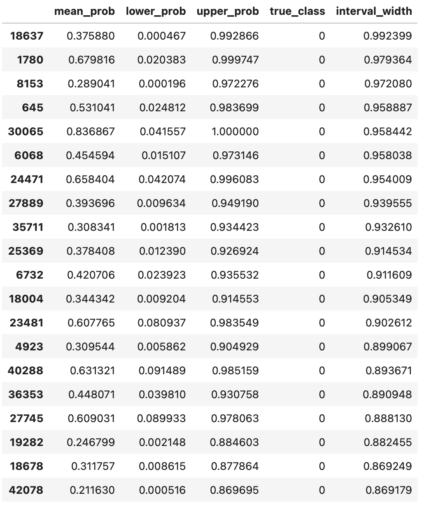

# bayesian-credit-card-fraud-detection

---

# 🧠 Bayesian Credit Card Fraud Detection

Machine learning project for fraud detection using **Logistic Regression (baseline + class-weighted)** and **Bayesian Logistic Regression (PyMC + ADVI)**, with **threshold optimization, cost-sensitive evaluation, and uncertainty quantification** on a highly imbalanced dataset.


---

Built an end-to-end fraud detection pipeline on a highly imbalanced credit card transaction dataset using **baseline logistic regression, class-weighted logistic regression, and Bayesian logistic regression**. Improved decision quality through **threshold optimization, cost-sensitive evaluation, and posterior uncertainty estimation**, showing that in rare-event classification, **operating threshold selection can be as important as model selection**. Demonstrated how Bayesian methods add value by quantifying uncertainty for ambiguous cases, which is especially useful in **high-risk business decisions** where confidence matters alongside prediction accuracy.

---

# 📌 Project Overview

This project tackles **credit card fraud detection**, a classic **extreme class imbalance problem (~0.17% fraud rate)**.

Rather than focusing only on classification accuracy, this project emphasizes:

* **Precision–Recall tradeoffs**
* **Threshold optimization**
* **Cost-sensitive decision-making**
* **Bayesian uncertainty estimation**

The goal is to build models that are not only predictive, but also **operationally useful in real-world fraud detection systems**.

---

# 📂 Dataset

* Source: Credit Card Fraud Detection dataset
  https://www.kaggle.com/datasets/mlg-ulb/creditcardfraud/data
* Observations: ~284,000 transactions
* Features:

  * PCA-transformed variables (`V1–V28`)
  * `Amount`
  * `Time`
  * Target: `Class` (`1 = Fraud`, `0 = Non-Fraud`)

⚠️ The dataset is **extremely imbalanced**:

* Fraud: ~0.17%
* Non-Fraud: ~99.83%

---

# ⚙️ Methodology

## 1. Data Preprocessing

* Train / validation / test split
* Stratified sampling to preserve fraud prevalence
* Feature scaling using `StandardScaler`
* No leakage across splits

## 2. Baseline Logistic Regression

* Standard L2-regularized logistic regression
* Interpretable benchmark model
* Strong precision, but more missed fraud cases

## 3. Class-Weighted Logistic Regression

* `class_weight="balanced"` to address class imbalance
* Significantly improves recall
* Requires threshold tuning because false positives increase sharply at the default threshold

## 4. Bayesian Logistic Regression

* Implemented in **PyMC**
* Priors:

  * Intercept: `Normal(0, 2)`
  * Coefficients: `Normal(0, 0.5)`
* Likelihood: Bernoulli with logistic link
* Inference: **ADVI** for scalable approximate Bayesian inference
* Outputs:

  * Posterior distributions over coefficients
  * Posterior predictive fraud probabilities
  * Prediction intervals for uncertainty-aware decisions

## 5. Threshold Optimization

Thresholds were tuned using three decision strategies:

* **Best F1**
* **Target Precision (≥ 0.80)**
* **Minimum Expected Cost**

  * False Positive cost = 1
  * False Negative cost = 25

## 6. Evaluation Metrics

* Average Precision (PR-AUC)
* ROC-AUC
* Precision
* Recall
* F1 Score
* Brier Score
* Confusion Matrix
* Cost-sensitive threshold comparison

---

# 📊 Key Results (Test Set)

| Model Policy                    | Precision | Recall |        F1 |
| ------------------------------- | --------: | -----: | --------: |
| **Weighted Logistic (Best F1)** |     0.803 |  0.770 | **0.786** |
| Baseline Logistic (0.5)         | **0.817** |  0.662 |     0.731 |
| Bayesian (Target Precision)     |     0.732 |  0.703 |     0.717 |
| Baseline (Best F1)              |     0.652 |  0.784 |     0.712 |

---

# 📈 Visualizations

## Precision–Recall Curve

Shows model performance on the minority fraud class and highlights why PR-based evaluation is more informative than accuracy for this problem.



## ROC Curve

Compares overall ranking ability across models. Useful for broad discrimination, though less informative than PR curves under extreme imbalance.



## Bayesian Predictive Uncertainty

Shows posterior mean fraud probabilities with uncertainty intervals. Narrow intervals indicate high-confidence predictions, while wider intervals highlight ambiguous transactions.



## Highest-Uncertainty Transactions

Highlights cases where the Bayesian model is least certain, which can support escalation to manual review.



---

# 🔍 Key Insights

### 1. Threshold choice matters as much as model choice

The same model can perform extremely differently depending on the decision threshold. In fraud detection, the default threshold of 0.5 is often suboptimal.

### 2. Class weighting improves recall, but can overwhelm operations without tuning

The weighted logistic model dramatically improved recall, but at the default threshold it generated too many false positives. Threshold optimization was necessary to make it operationally useful.

### 3. Simple models can still be strong

The baseline logistic regression performed very well, showing that interpretable models remain strong benchmarks when features are informative.

### 4. Bayesian models add decision value through uncertainty

The Bayesian model did not achieve the top F1 score, but it produced posterior uncertainty intervals for predicted fraud probabilities. That makes it more useful in situations where the cost of acting on uncertain predictions is high.

### 5. Cost-sensitive evaluation changes the definition of “best”

The optimal threshold depends on business priorities. A model-policy combination that maximizes F1 may not minimize expected financial loss.

---

# Why Bayesian Models Can Be Superior

Bayesian models can be superior when the business needs more than a hard classification. Traditional models typically produce a point estimate, while Bayesian models produce a **distribution over plausible outcomes and parameters**. That means they can quantify not only what the model predicts, but also **how certain it is**. This is especially useful in business settings where wrong decisions are costly, data are limited or noisy, or stakeholders need interpretable measures of confidence.

Bayesian methods are particularly valuable in situations such as:

* **Fraud detection and risk scoring**, where uncertain cases may need manual review
* **Medical diagnosis**, where false decisions carry serious consequences
* **Financial forecasting**, where decisions should reflect uncertainty, not just averages
* **Operations and supply chain planning**, where uncertain demand or disruption risk matters
* **Low-data or shifting-data environments**, where prior knowledge can improve stability

In these contexts, Bayesian models are useful because they support **risk-aware decision-making**, not just prediction.

---

# 🧠 Model Comparison Summary

| Approach          | Strengths                                             | Limitations                                         |
| ----------------- | ----------------------------------------------------- | --------------------------------------------------- |
| Baseline Logistic | High precision, simple, interpretable                 | Lower recall                                        |
| Weighted Logistic | High recall, best F1 after tuning                     | Poor default precision, sensitive to threshold      |
| Bayesian Logistic | Uncertainty quantification, flexible decision support | Slightly lower predictive performance, more complex |

---

# 🚀 Real-World Impact

This project shows how to move from:

**“Train a classifier”**
to
**“Design a decision system.”**

By combining:

* threshold optimization
* cost-aware evaluation
* uncertainty quantification

the project demonstrates a more realistic fraud analytics workflow that can support:

* fraud operations teams
* human review pipelines
* risk scoring systems
* business rules for alert prioritization

---

# 🛠️ Tech Stack

* Python
* pandas
* NumPy
* scikit-learn
* PyMC
* ArviZ
* Matplotlib
* Seaborn

---

# 📂 Suggested Repository Structure

```bash
bayesian-credit-card-fraud-detection/
│
├── data/
│   ├── raw/
│   └── processed/
├── figures/
│   ├── precision_recall_curve.png
│   ├── roc_curve.png
│   ├── threshold_policy_comparison.png
│   ├── bayesian_uncertainty_intervals.png
│   └── high_uncertainty_cases.png
├── notebooks/
│   └── fraud_detection_analysis.ipynb
├── README.md
└── requirements.txt
```

---

# Final Takeaway

> In highly imbalanced fraud detection problems, the best solution is not just the best model. It is the best combination of **model, threshold, and decision strategy**.
